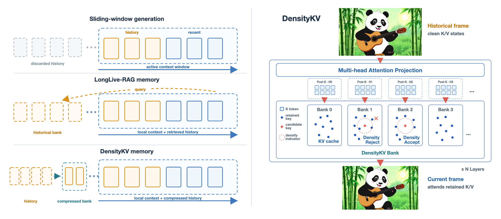

# DensityKV

Official implementation of **DensityKV: Density-Guided KV Cache Compression
for Long Video Generation**.

[Project page](https://zhaowqq.github.io/DensityKV/) ·
[Paper PDF](docs/assets/densitykv-paper.pdf)

DensityKV is a training-free historical memory for autoregressive video
diffusion. It decomposes clean generated frames into layer-, head-, and
token-specific key/value states, then keeps a bounded coreset in each attention
key space. Keys determine admission and eviction; values remain exact paired
payloads.

## Results

### Long-Horizon Video Comparisons

https://github.com/user-attachments/assets/e31458c5-314e-4faf-9581-357bc9b8a83a

https://github.com/user-attachments/assets/876697b4-f79e-4ed8-bb97-a20d5f308e6f

https://github.com/user-attachments/assets/7e785ff4-e0d8-4fb8-bc24-b3438c7b38c2

### Method Overview



DensityKV retains fully denoised historical K/V states in independent
head-specific banks. Each bank uses post-RoPE key-space density to control
admission and eviction, while values remain paired with their original keys.

## Submission Configuration

All retained paper examples use the same final DensityKV policy:

| Setting | Value |
|---|---|
| AR base model | Wan2.1-T2V-1.3B |
| Backbones | Causal-Forcing, Self-Forcing, LongLive |
| Bank capacity | 9,360 tokens per attention head |
| Local context | 5 recent latent frames |
| Geometry | post-RoPE keys; zero temporal coordinate and native spatial coordinates |
| Distance | squared Euclidean |
| Soft-Riesz kernel | `eps=1`, `p=2`, `sigma=sqrt(d_k/2)=8` |
| Admission | Insertion-relative density growth, threshold `2.0` |
| Candidate order | maximum normalized influence |
| Head policy | one synchronized admission count across heads |
| Eviction | mandatory violations, then densest retained keys |

The generator weights remain frozen. DensityKV does not train a retriever or
modify the diffusion objective.

This public release contains the DensityKV inference path, matched baseline
adapters, and launchers for the qualitative paper cases. Training checkpoints,
internal experiment tooling, and generated artifacts are intentionally omitted.

## Installation

The implementation follows the released LongLive / LongLive-RAG Wan2.1
environment. A recent CUDA PyTorch build and FlashAttention are required.

```bash
conda create -n densitykv python=3.11 -y
conda activate densitykv
pip install -r requirements.txt
pip install flash-attn --no-build-isolation
```

Download the Wan base model and place the released AR checkpoints as follows:

```text
wan_models/Wan2.1-T2V-1.3B/
checkpoints/
├── causal_forcing.pt
├── self_forcing.pt
├── longlive_base.pt
├── longlive_lora.pt
└── ae_latent_mem.pt        # only needed for the RAG comparison
```

## Example Cases

The code release keeps the four qualitative entry points used by the paper.
Each launcher runs a matched `base`, `rag`, and `densitykv` comparison unless
`--methods` narrows the list.

| Case | Backbone | Length | Seed |
|---|---|---:|---:|
| Panda playing guitar | Causal-Forcing | 120 s | 13 |
| Kangaroo disco dance | Causal-Forcing | 120 s | 0 |
| Rabbit reading a newspaper | Causal-Forcing | 60 s | 0 |
| Wig and sunglasses transformation | LongLive | 120 s | 0 |

```bash
# Panda playing guitar, Causal-Forcing, 120 s
GPU=0 bash scripts/run_figure1_panda.sh

# Kangaroo disco dance, Causal-Forcing, 120 s
GPU=0 bash scripts/run_figure3_kangaroo.sh

# Rabbit reading a newspaper, Causal-Forcing, 60 s
GPU=0 bash scripts/run_figure5_rabbit.sh

# Wig-and-sunglasses transformation, LongLive, 120 s
GPU=0 bash scripts/run_sunglasses_man.sh
```

Useful variants:

```bash
# Inspect resolved commands/configs without loading a model.
python scripts/run_paper_case.py --case figure1_panda --dry-run

# Run only DensityKV.
python scripts/run_paper_case.py \
  --case sunglasses_man --methods densitykv --gpu 0

# Record the all-layer temporal-attention sidecar used by the panda comparison.
python scripts/run_paper_case.py \
  --case figure1_panda --methods base densitykv \
  --attention-trace --gpu 0
```

Resolved configs and videos are written below:

```text
outputs/paper_cases/<case>/
├── resolved_configs/
├── base/
├── rag/
└── densitykv/
```

The official VBench-Long package is used for quantitative evaluation and is not
vendored here. Generation and metric evaluation should use the same 128 refined
MovieGenBench prompts and 30/60/120-second prefixes described in the paper.

## Code Layout

```text
kv_cache/                       DensityKV state and fused kernels
utils/density_kv_integration.py Model attachment and attention packing
wan/modules/causal_model_latentmem.py
                                Clean-KV commit and memory attention path
pipeline/causal_inference.py    Autoregressive rollout
configs/examples/               Final paper protocol
scripts/                        Four retained paper-case launchers
tests/                          Lightweight contract tests
docs/                           Static project page
```

## Project Page

The static project page lives in `docs/` and is deployed through GitHub Pages.
It can also be opened locally from [docs/index.html](docs/index.html). Three
matched 120-second comparison videos are retained as the public qualitative
showcase; unrelated generated outputs remain outside the source repository.

## Acknowledgements

This repository builds on Wan2.1, Self-Forcing, Causal-Forcing, LongLive, and
LongLive-RAG. Their original licenses and checkpoint terms continue to apply.

## License

See [LICENSE](LICENSE). GitHub-compatible citation metadata is available in
[CITATION.cff](CITATION.cff).
